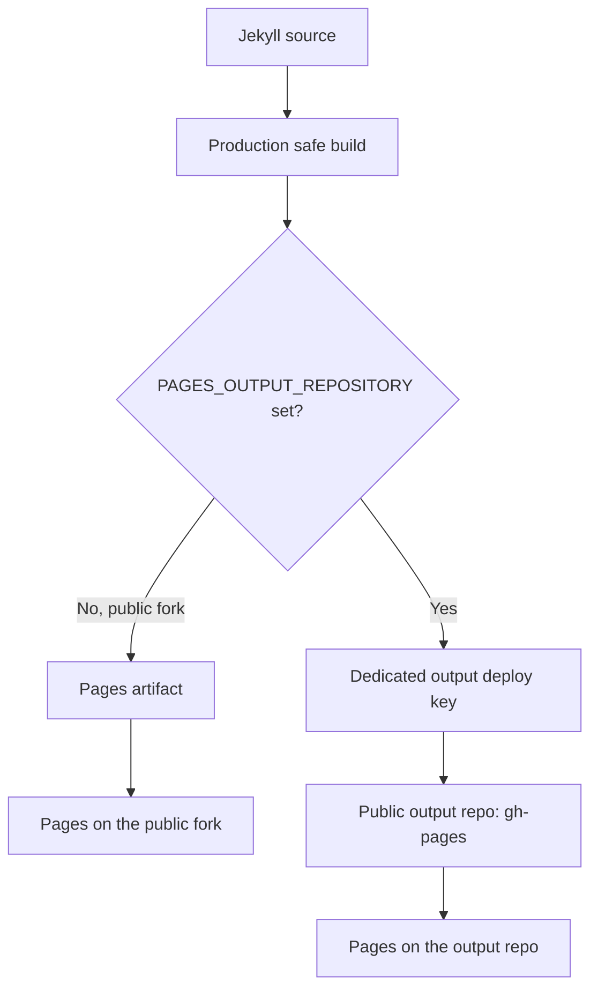
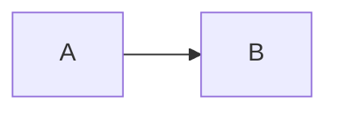

# Bootstrap 5 Jekyll Theme

Simple, modern Bootstrap 5 theme for Jekyll. A successor to [Bootstrap-4-Jekyll-Theme](https://github.com/takasoft/Bootstrap-4-Jekyll-Theme).

## Features

- Bootstrap **5.3.8** — no jQuery dependency, single bundle (includes Popper), loaded from jsDelivr CDN with SRI hashes
- **Build-time LaTeX** via kramdown + KaTeX — math is rendered to HTML at build time; no client-side JS engine at runtime
- Lazy-loaded **Mermaid** diagrams — only fetched on pages that contain a ` ```mermaid ` block
- Mobile-friendly long equations — `.katex-display` gets horizontal scroll instead of pushing the layout wide
- **Cloudflare Web Analytics** and **Google Analytics 4** — both controlled by `_config.yml` flags, both off by default
- Auto-generated **Related Posts** ranked by shared `tags` / `categories`
- Pagination, category pages, RSS/Atom feed, syntax highlighting
- Two publishing paths: a public fork, or private source with separate public output
- Page-aware Open Graph and Twitter cards, with optional preview images
- Optional pinned posts, without removing categories or numbered pagination
- Local-preview-safe navigation and assets, including project-site subpaths
- Development tab labels and automatic Markdown cache recovery for math

### What changed from Bootstrap-4-Jekyll-Theme?

- Bootstrap 4.3.1 → 5.3.8 (jQuery removed; ~15 KB gzip lighter and 2 fewer requests)
- Universal Analytics (deprecated) replaced with GA4 + Cloudflare Web Analytics
- Switched from dying `stackpath.bootstrapcdn.com` to `cdn.jsdelivr.net` with SRI integrity hashes
- Bootstrap 5 attribute renames applied throughout (`data-bs-toggle`, `ms-auto`, `visually-hidden`, etc.)
- CSS workaround for Bootstrap 5's default link underline on post titles
- Math rendering moved from client-side MathJax to build-time KaTeX (kramdown's `math_engine: katex`)
- Both publishing paths use Actions so build-time math and custom gems work

### Page load: v4 vs v5

Measured against the home page CDN assets (Bootstrap CSS + JS + jQuery + Popper for v4; Bootstrap CSS + bundled JS for v5), gzipped over the wire:

|                       | v4 stack                    | v5 stack                | Delta             |
| --------------------- | --------------------------- | ----------------------- | ----------------- |
| Requests              | 12                          | 10                      | −2                |
| Total transfer (gzip) | ~365 KB                     | ~350 KB                 | −15 KB (−22% of Bootstrap stack) |
| jQuery                | required (~30 KB gzip)      | dropped                 | gone              |
| Popper                | separate script             | bundled into Bootstrap  | one fewer request |

Mermaid (~500 KB compressed) is loaded only when the page actually needs it. KaTeX CSS (~26 KB) is loaded only on pages where the layout detects KaTeX markup in the rendered content, and KaTeX fonts download on-demand only when a math glyph is rendered on screen.

## Choose a publishing path

| Path | Source | Public website | Credentials to configure |
| --- | --- | --- | --- |
| **1. Public fork (default)** | A public fork of this theme | Pages on the same repository | None |
| **2. Private source** | A separate private copy | Pages on a separate public output repository | A dedicated output deploy key |

Both paths use the included [Actions workflow](.github/workflows/deploy.yml) and
the same production Jekyll build. The public path does not require a second
repository, personal access token, or deploy key. Actions is used for that path
too because Pages' built-in branch builder does not support the
`kramdown-math-katex` gem.

### Path 1: Fork and publish publicly

1. **Fork this repository** into your account. Keep it public. Leave its name unchanged for a project site, or rename it to `<your-username>.github.io` for a user site.
2. **Edit [_config.yml](_config.yml)** with your title, description, and public URL. Set `url: https://your-username.github.io`. For a project site, set `baseurl: /your-repo-name`. For a user site, set `baseurl: ""`.
3. **Enable Actions in your fork** from the Actions tab if GitHub asks. Leave the `PAGES_OUTPUT_REPOSITORY` repository variable unset.
4. **Enable Pages** in the fork's `Settings > Pages`, choosing **GitHub Actions** as the source. Do not select "Deploy from a branch" for this path.
5. **Run the deployment** from `Actions > Build and deploy to Pages > Run workflow`, or push a change to `main`. The workflow publishes the built site directly to the fork's Pages site.

Your source, posts, and Git history remain public. No generated `gh-pages` branch
is needed. If you renamed the default branch, update the workflow's push trigger.
For a custom domain, configure it in the fork's Pages settings and update `url`
and `baseurl` to match.

### Path 2: Private source with automatic public output

1. **Create a private source repo from a copy of this theme.** A fork of a public repository cannot be made private. Use a separate repository.
2. **Create a separate public output repo** for the built website. Use `<your-username>.github.io` for a user site, or another name for a project site. Initialize it with an empty commit.
3. **Create a dedicated SSH deploy key pair** for the output repo. Add the public key in that repo's `Settings > Deploy keys`, with write access enabled. Store the private key in the source repo's Actions secret `PAGES_DEPLOY_KEY`. Never commit the private key or reuse another repository's key.
4. **Select external publishing** in the source repo's `Settings > Secrets and variables > Actions > Variables`. Set `PAGES_OUTPUT_REPOSITORY` to `your-username/your-output-repo`. Optionally set `PAGES_CUSTOM_DOMAIN` to your custom domain, without a URL scheme.
5. **Edit [_config.yml](_config.yml)** for the public output address, not the private source repo. Set `url` to the public origin. Set `baseurl: ""` for a user site or custom domain, or `/your-output-repo` for a project site.
6. **Enable Actions in the source repo**, then run `Build and deploy to Pages` manually or push to `main`. The workflow publishes only `_site/` to the output repo's `gh-pages` branch as a single orphan commit.
7. **Enable Pages in the output repo** with **Deploy from a branch**, selecting `gh-pages` and `/ (root)`. Do not enable Pages on the private source repo.

This path supports private source on GitHub Free because Pages serves the public
output repo. Private-repository Actions usage remains subject to your account's
included minutes, storage, and spending settings. The website and generated
files are public even though source history stays private.

### How the workflow selects a path

The `PAGES_OUTPUT_REPOSITORY` variable is the switch. Unset means same-repository
Pages. A value selects external output and skips the same-repository Pages job.
Private source without that variable fails with a setup message rather than
silently attempting to publish its own Pages site.



The build job's `GITHUB_TOKEN` has read-only repository and Pages permissions.
Only the same-repository deployment job requests `pages: write` and
`id-token: write`, using the `github-pages` environment. External publishing uses
the deploy key instead. Existing environment and branch protections still apply.

The output repo must allow the action's orphan updates. Follow your repository's
approval and branch policies rather than disabling protections. The workflow
rejects using the source repository as its own external output.

For an existing token-based deployment, configure the output variable and new
key before switching workflows. Confirm a successful deployment before removing
the old secret. Removing a secret does not revoke the old token. Deploy keys do
not expire automatically, and anyone holding the private key can use it outside
GitHub Actions. Remove temporary key files after secure secret storage.

For background on the private-source pattern, see the
[private Jekyll hosting walkthrough](https://takasoft.io/blog/hosting-private-jekyll-source-on-github-free).

## Local preview

```shell
gem install jekyll bundler
bundle install
bundle exec jekyll serve
```

Node.js needs to be on `PATH` (the `kramdown-math-katex` gem calls KaTeX through ExecJS during builds with math). The GitHub Actions runner has Node preinstalled.

Use Ruby 3.3, matching [.ruby-version](.ruby-version). Local browser tabs include
`(dev)`, while production builds keep the normal site title. Internal navigation
and assets stay on the current origin, even when `url` names the production site.
The configured `baseurl` applies to links, icons, pagination, and the Atom feed.
Social metadata and Atom entry URLs remain absolute for external readers.

If Ruby is unavailable on Windows, start Docker Desktop and run from the
repository directory in PowerShell:

```powershell
docker run --rm --name jekyll-theme-preview `
  --publish 127.0.0.1:4000:4000 `
  --mount "type=bind,source=$($PWD.Path),target=/site" `
  --mount type=volume,source=jekyll-theme-gems,target=/usr/local/bundle `
  --workdir /site --env JEKYLL_ENV=development ruby:3.3 sh -lc `
  'apt-get update -qq && apt-get install -y --no-install-recommends nodejs && bundle install --jobs 4 --retry 2 && bundle exec jekyll serve --host 0.0.0.0 --port 4000 --force_polling'
```

Open <http://127.0.0.1:4000/bootstrap5-jekyll-theme/> with the default `baseurl`.
Use <http://127.0.0.1:4000/> if `baseurl` is empty. The port is available only on
this computer. The named volume retains gems, and polling detects changes through
the Windows bind mount. Stop with `docker stop jekyll-theme-preview`.

Restart the server after editing [_config.yml](_config.yml). If math renders as
raw delimiters, confirm Node.js and `kramdown-math-katex` are installed.
The [development cache hook](_plugins/clear_markdown_cache.rb) clears only
Jekyll's Markdown converter cache on each reset, including its memory cache and
configured disk location. It does not run in production or under `--safe`.
For a safe-mode preview, use `bundle exec jekyll clean` before rebuilding if needed.

### Checking theme changes

After `bundle install`, run the production build and the dependency-free Ruby
regression checks:

```shell
JEKYLL_ENV=production bundle exec jekyll build --safe
bundle exec ruby tests/theme_test.rb
```

In PowerShell, set `$env:JEKYLL_ENV = 'production'` before the build instead of
using the inline environment assignment. The checks build disposable synthetic
sites with both empty and nonempty `baseurl`, custom pagination paths, pinned
posts, social metadata, math, and cache behavior. They do not deploy anything.
The build excludes tests, documentation, dependencies, and caches from `_site/`.

## Writing posts

Drop a markdown file in `_posts/` named `YYYY-MM-DD-title.md`. Standard Jekyll front matter applies (`title`, `date`, `layout: post`, `categories`, `tags`).

### Pinned posts

Add `pinned: true` to a post's front matter to promote it above the chronological
listing on the first page. Pinned cards use the same titles, images, excerpts,
dates, and categories as ordinary cards.

A promoted post appears only once on the first page. It still appears at its
normal dated position on later pages, because `jekyll-paginate` counts all posts.
This keeps later pages populated and preserves existing page URLs and counts.
With no pinned posts, the normal listing is unchanged.

### Social link previews

The homepage advertises the site title and description. Posts advertise their
own title and excerpt, or a `description:` front-matter override. Other pages use
their page title and the site description unless overridden.

Set `image:` on a page or post to use its thumbnail for sharing. Optionally add
`social_image:` in [_config.yml](_config.yml) as the fallback. Both accept a
site-relative path or an absolute HTTPS URL. Supply your own image file.
Without an image, the theme emits a summary card and omits image metadata
instead of linking to a nonexistent default image. Image dimensions are not
assumed. Set `image_alt:` for thumbnail alternative text when needed.

### LaTeX math (build-time KaTeX)

Just use kramdown's `$$...$$` syntax — no front-matter flag required. Inline math goes on the same line as text; display math sits in its own paragraph with blank lines around it:

```markdown
Inline: $$ E = mc^2 $$.

Display:

$$
\int_0^\infty e^{-x^2}\, dx = \frac{\sqrt{\pi}}{2}
$$
```

The math is rendered to HTML at build time. The layout auto-detects pages that contain KaTeX markup and pulls in KaTeX's CSS only on those pages — non-math pages don't pay the ~26 KB cost. Readers don't need JavaScript enabled to see math; only the CSS file.

See `_posts/2026-05-19-math-typesetting.md` for a working example.

### Mermaid diagrams

Just write a fenced code block tagged `mermaid` — no flag needed; the loader in `_includes/footer.html` detects them automatically and lazy-imports Mermaid:

````markdown

````

See `_posts/2026-05-19-mermaid-diagrams.md`.

### Categories (manual step)

For each new category, create `category/<name>.html`:

```markdown
---
layout: category
title: Category Name
category: category-name
---
```

### Related Posts

Add `tags:` and/or `categories:` to a post's front matter. The "Related Posts" section is auto-generated, ranked by overlap (more shared tags/categories = higher rank), with date as a tie-breaker. The section hides itself when no other post shares any tag/category.

### Embed a YouTube video

```liquid

```

## Analytics

### Cloudflare Web Analytics

Privacy-friendly, no cookies, no consent banner. Sign up at <https://www.cloudflare.com/web-analytics/>, then set in `_config.yml`:

```yaml
cloudflare_analytics_token: your-token-here
```

### Google Analytics 4

Set your GA4 measurement ID in `_config.yml`:

```yaml
google_analytics: G-XXXXXXXXXX
```

## License

MIT. See [LICENSE](LICENSE).
