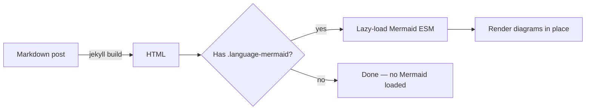
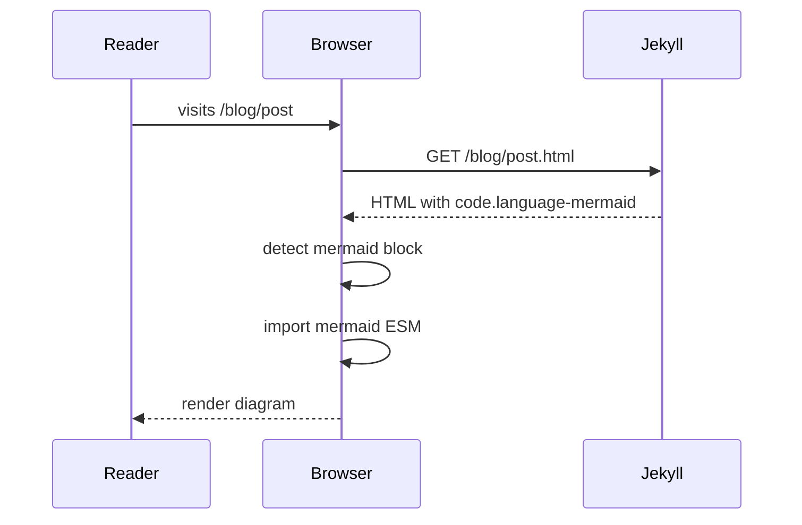

Mermaid is loaded lazily — the script in `_includes/footer.html` checks
for `.language-mermaid` elements in the DOM and only fetches Mermaid
when at least one is present. Posts without diagrams don't pay the cost.

A simple flowchart:

A sequence diagram:

